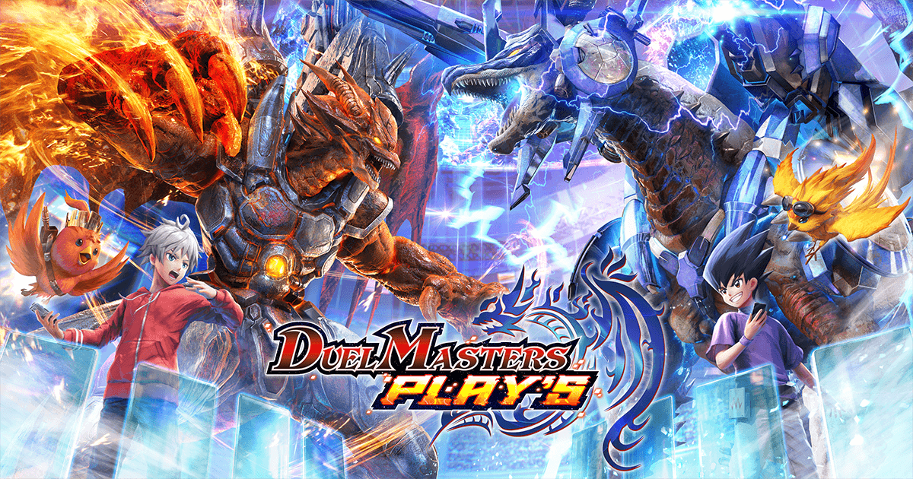

# Restarting Game Duel Masters (RGDM)
This is for those who want to
make application play automatically.

# Getting Started
## Prerequisites
* [Android Studio 4.0](https://developer.android.com/studio/install).

## Installation & Run source code
You should set up environment kind of [anaconda](https://docs.anaconda.com/anaconda/install/linux/) or [miniconda](https://docs.conda.io/en/latest/miniconda.html) in advance.

    git clone https://github.com/nagaitomoaki/rgdm.git
    cd rgdm
    jupyter notebook restart.ipynb

## Optional
Be careful, this is not worked with Android-studio.
### Set up environment with docker

Clone repository or just copy Dockerfile and set up docker environment.

    git clone https://github.com/nagaitomoaki/rgdm.git
    cd rmgd
    sudo docker build -t rgdm .
    sudo docker run --name="rgdm_dev" -t  -i -d -p 8888:8888 -v /home/rgdm:/tmp/rgdm rgdm /bin/bash
    sudo docker exec -it rgdm_dev /bin/bash

### Installation in docker container
    cd /tmp
    git clone https://github.com/nagaitomoaki/rgdm.git
    cd rgdm
    jupyter notebook --ip 0.0.0.0 --no-browser --allow-root
